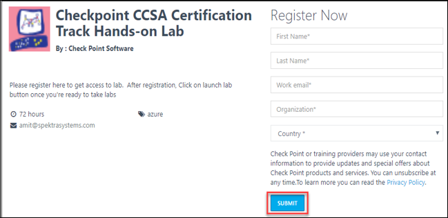
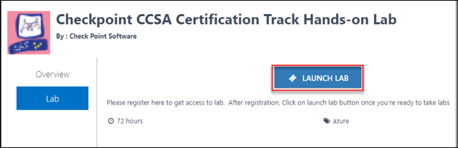
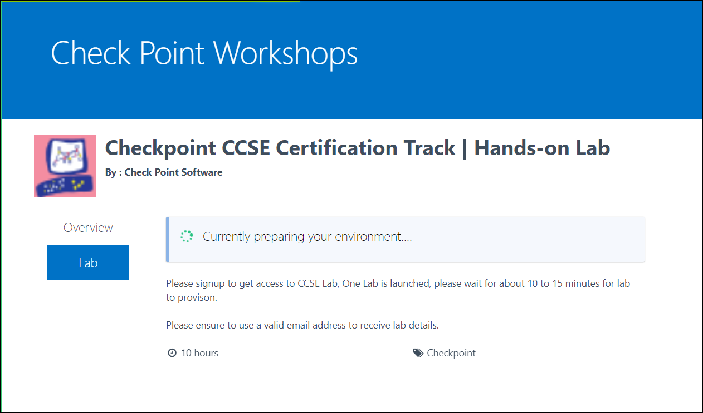
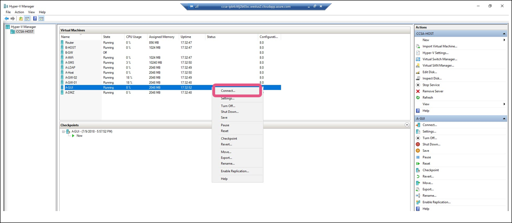

# Check-Point-Labs

# Accessing Hands-on Labs CCSE/CCSA

# Overview
This lab guide will help you in getting started on accessing the hands-on lab infrastructure for
Checkpoint CCSA/CCSE Lab. 

# Contents 
* Checkpoint CCSE/CCSA Certification: Accessing Hands-on Labs
1. Registration for the Labs
* Lab Overview
* Prerequisites
* Time estimate
* Exercise 1-Option-1: Register via Signup URL 
* Exercise 1 Option-2: Register via Custom Invite 
* Exercise 2: Access the CCSE/CCSA Host Lab Server and VMs
* Exercise 3: Start VMs using Hyper-V 
* Exercise 4: Start,Stop,Restart the Lab Server

# 1. Registration for the Labs 
# Lab Overview:
There’re two ways you could register for the labs., One is when an instructor provides you a signup
link, second when you receive an exclusive invite. Please follow steps based on the registration details
provided to you.

# Prerequisites:
* You should have received a lab registration URL from your instructor OR
* You should have received an exclusive invite for the lab signup

# Time Estimate
 2 Minutes
 
 # Exercise 1-Option-1: Register via Signup URL 
 1. **Launch** a modern web browser(Edge,Chrome,Firefox etc.) and open the lab registration
portal. **URL** should be provided to you by your instructor 
2. **Enter** the required details and click on **Submit**
 
3. Once registration is completed, **Click on Launch Lab** WHEN you’re ready to start the lab.
Note that the lab environment provisioning will start as soon as you click on Launch Lab. So
you should do this only once you’re ready.
 
4. This will start provisioning the lab environment. Note that this can take around 10-20 minutes for
the lab environment provisioning to finish. You can close this web browser if you wish to,
you’d get another email with lab details once provisioning is completed. 
 
5. Once provisioning is completed, you’d find following details on lab details page and the
email.
 * Azure Login Username Password: This is just to look at azure infrastructure (Read access).
 * CCSE/CCSA Host DNS Name: You’d use this to take RDP of the Host Machine.
 * CCSE/CCSA Host Credentials: Username and password for the host. 

6. At any point, if you miss the lab details, you can always click on Launch lab during the
lab duration and this will open up web page with lab details.

# Exercise 1 Option-2: Register via Custom Invite 
1. You’d have received an automated invite to launch the Lab. Click on Launch Lab, Once you’re
ready to start the lab.

2. This will open up a web page, **Click on Launch Lab** again WHEN you’re ready to start the lab.
Note that the lab environment provisioning will start as soon as you click on Launch Lab.

3. This will start provisioning the lab environment. Note that this can take around to 15 - 20 minutes for the
lab environment provisioning to finish. You can close this web browser if you wish to, you’d get
another email with lab details once provisioning is completed. 
4. Once provisioning is completed, you’d find following details on lab details page and the
email.
 * Azure Login Username Password: This is just to look at azure infrastructure (Read access).
 * CCSE/CCSA Host DNS Name: You’d use this to take RDP of the Host Machine.
 * CCSE/CCSA Host Credentials: Username and password for the host. 
 
5. At any point, if you miss the lab details, you can always click on **Launch lab** during the lab duration and this will open up web page with lab details. 

# Exercise 2: Access the CCSE/CCSA Host Lab Server and VMs

**In this exercise, you will take remote of the CCSE/CCSA Lab Server** 
1. Copy the CCSE/CCSA Host DNS Name from lab details webpage/email
2. Launch Microsoft RDP Client, by searching for remote desktop in Start Menu or entering mstsc
in run/command prompt.
3. Enter the DNS name in computer field copied from lab details.

4. Click on **More Choices** if you get a prompt with your local username.

5. Enter the Host VM credentails(**Admin/Chkp!234**) 
6. Check the option for Don’t ask me again for connection and Click on **Yes** if prompt as shown
below:

7.  Once you’re inside the server, You can launch **Hyper-V Manager** available on task bar to
connect to CCSA VMs. 
 

8. You’d see list of all VMs in Hyper-V Manager. You can connect to a VM by right clicking on it
and saying connect. Accept the default resolution option if asked. 

# Exercise 3: Start VMs using Hyper-V Manager
**In this exercise, you will use Hyper-V Manager to start VMs**
1. Once you’re inside the server, You can launch **Hyper-V Manager** available on task bar to
connect to CCSA VMs. 
 
2. You’d see list of all VMs in **Hyper-V Manager**. You can start the VM by just clicking on it and
select Start option on the right pane of the window.

