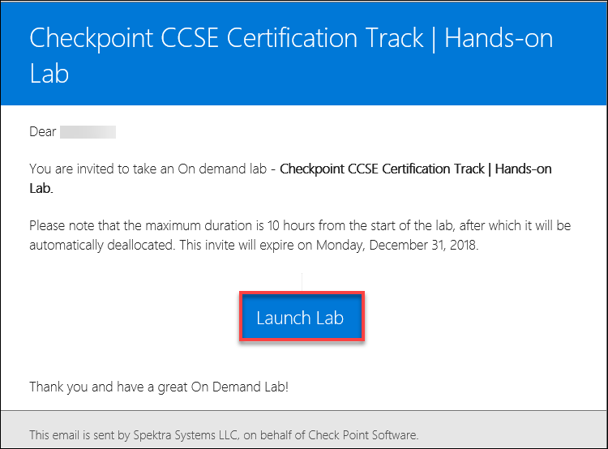

# Option-1: Register via Signup URL

1. You’d have received an automated invite to launch the Lab. Click on Launch Lab, Once you’re
ready to start the lab.

2. This will open up a web page, **Click on Launch Lab** again WHEN you’re ready to start the lab.
Note that the lab environment provisioning will start as soon as you click on Launch Lab.

3. This will start provisioning the lab environment. Note that this can take around to 15 - 20 minutes for the
lab environment provisioning to finish. You can close this web browser if you wish to, you’d get
another email with lab details once provisioning is completed. 
4. Once provisioning is completed, you’d find following details on lab details page and the
email.
 * Azure Login Username Password: This is just to look at azure infrastructure (Read access).
 * CCSE/CCSA Host DNS Name: You’d use this to take RDP of the Host Machine.
 * CCSE/CCSA Host Credentials: Username and password for the host. 
 
5. At any point, if you miss the lab details, you can always click on **Launch lab** during the lab duration and this will open up web page with lab details. 
