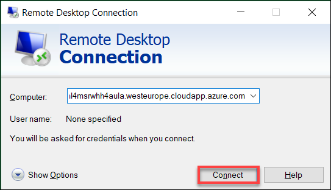
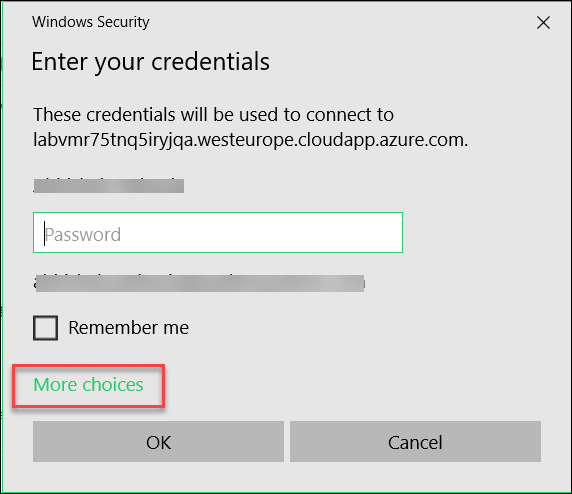
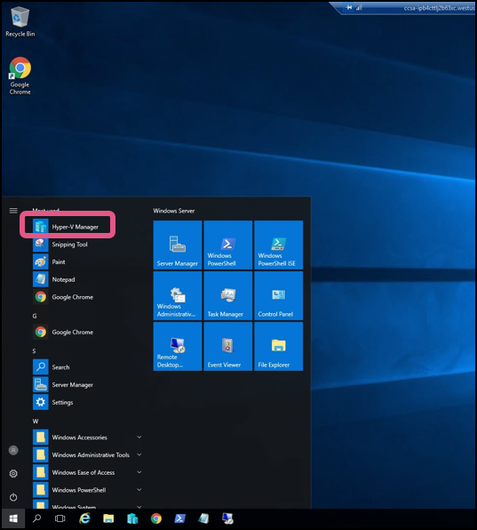
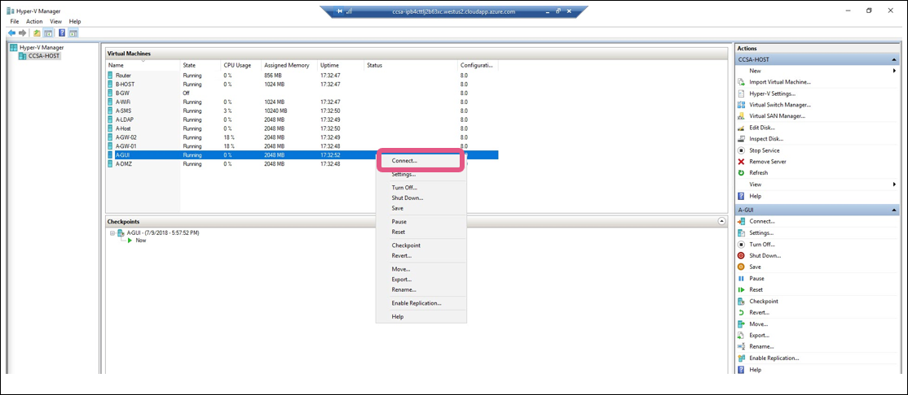

[Home](./../README.md)
# Exercise-2: Access the CCSE/CCSA Host Lab Server and VMs

> In this exercise, you will take remote of the CCSE/CCSA Lab Server
1. Copy the CCSE/CCSA Host DNS Name from lab details webpage/email
2. Launch Microsoft RDP Client, by searching for remote desktop in Start Menu or entering mstsc
in run/command prompt.
3. Enter the DNS name in computer field copied from lab details.

4. Click on **More Choices** if you get a prompt with your local username.

5. Enter the Host VM credentails(**Admin/Chkp!234**)
6. Check the option for Don't ask me again for connection and click on **yes** if prompt.

7. Once you’re inside the server, You can launch **Hyper-V Manager** available on task bar to connect to CCSA VMs. 

8. You’d see list of all VMs in Hyper-V Manager. You can connect to a VM by right clicking on it
and saying connect. Accept the default resolution option if asked. 

[Back](./Exercise-1-Registration-for-the-Labs.md#register-using-signup-link)&nbsp;&nbsp;&nbsp;&nbsp;&nbsp;&nbsp;&nbsp;&nbsp;&nbsp;&nbsp;&nbsp;&nbsp;&nbsp;&nbsp;&nbsp;&nbsp;&nbsp;&nbsp;&nbsp;&nbsp;&nbsp;&nbsp;&nbsp;&nbsp;&nbsp;&nbsp;&nbsp;&nbsp;&nbsp;&nbsp;&nbsp;&nbsp;&nbsp;&nbsp;&nbsp;&nbsp;&nbsp;&nbsp;&nbsp;&nbsp;&nbsp;&nbsp;&nbsp;&nbsp;&nbsp;&nbsp;&nbsp;&nbsp;&nbsp;&nbsp;&nbsp;&nbsp;&nbsp;&nbsp;&nbsp;&nbsp;&nbsp;&nbsp;&nbsp;&nbsp;&nbsp;&nbsp;&nbsp;&nbsp;&nbsp;&nbsp;&nbsp;&nbsp;&nbsp;&nbsp;&nbsp;&nbsp;&nbsp;&nbsp;&nbsp;&nbsp;&nbsp;&nbsp;&nbsp;&nbsp;&nbsp;&nbsp;&nbsp;&nbsp;&nbsp;&nbsp;&nbsp;&nbsp;&nbsp;&nbsp;&nbsp;&nbsp;&nbsp;&nbsp;&nbsp;&nbsp;&nbsp;&nbsp;&nbsp;&nbsp;&nbsp;&nbsp;&nbsp;&nbsp;&nbsp;&nbsp;&nbsp;&nbsp;&nbsp;&nbsp;&nbsp;&nbsp;&nbsp;&nbsp;&nbsp;&nbsp;&nbsp;&nbsp;&nbsp;&nbsp;[Next](./Exercise-3-Start-VMs-using-Hyper-V.md#exercise-3-start-vms-using-hyper-v-manager)
