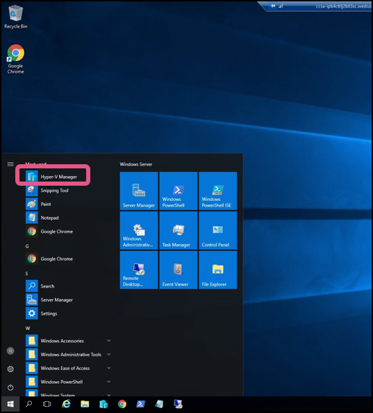

[Home](./../README.md)
# Exercise 3: Start VMs using Hyper-V Manager
**In this exercise, you will use Hyper-V Manager to start VMs**
1. Once you’re inside the server, You can launch **Hyper-V Manager** available on task bar to
connect to CCSA VMs. 
 
2. You’d see list of all VMs in **Hyper-V Manager**. You can start the VM by just clicking on it and
select Start option on the right pane of the window.

3. This will start the VM

> Note: Please start the VMs Router and A-LDAP before you start any other VMs
