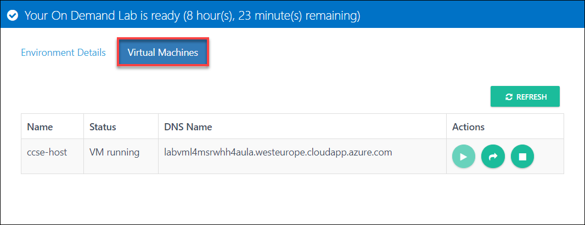
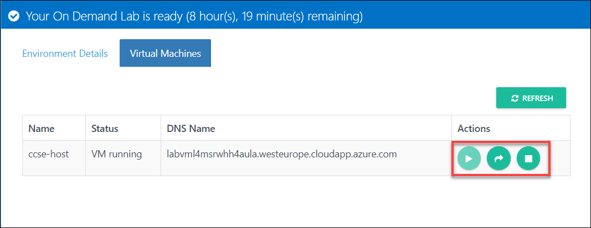

[Home](./../README.md)
# Exercise 4: Start,Stop,Restart the Lab Server. 

1. If by mistake, you end up shutting down the host lab server itself, you can start this by
following below instructions.
2. Click on the launch lab link from the emails again. This will open up your lab details page.
3. Click on Virtual Machines, As specified in below link. 
 
4. You can use toolbar items to start/restart/stop the server. 
 
 
 > Please note that these operation might take 5 to 10 minutes to complete. You can view the

[Back](./Exercise-3-Start-VMs-using-Hyper-V.md#exercise-3-start-vms-using-hyper-v-manager)
